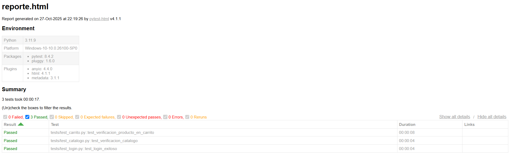
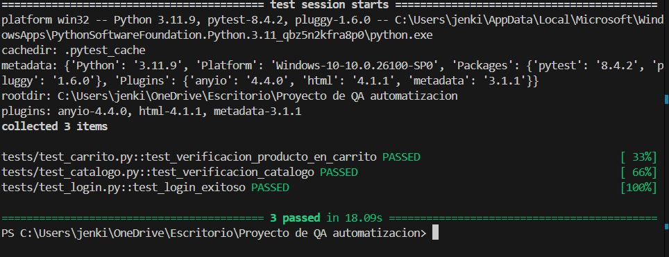

🧪 Proyecto de Automatización de Pruebas Funcionales

🎯 Propósito del Proyecto

Este proyecto tiene como objetivo principal la automatización de un flujo crítico de negocio en la aplicación de comercio electrónico de práctica SauceDemo. La automatización busca garantizar la repetibilidad y confiabilidad de las pruebas funcionales sobre los flujos principales (login, catálogo y carrito).

📦 Estructura del Proyecto

pre-entrega-automation-testing-JEIMMYORTIZ/
├── driver/                                      # Contiene el binario del ChromeDriver (Necesario para Selenium)
│   └── chromedriver.exe
├── imagenes/                                    # Contiene imágenes de los resultados de las pruebas
│   └── test-consola.png
│   └── test-reports.png
├── tests/                                        # Contiene todos los scripts de pruebas funcionales
│   ├── test_login.py                             # Prueba de login exitoso
│   ├── test_catalogo.py                          # Prueba de catálogo de productos
│   └── test_carrito.py                           # Prueba de flujo del carrito
├── reports/                                      # Carpeta para almacenar reportes HTML
├── conftest.py                                   # Archivo para fixtures compartidas (configuración del WebDriver)
├── README.md                                     # Este archivo descriptivo
└── requirements.txt                              # Dependencias del proyecto

⚙️ Requisitos Previos

Antes de ejecutar las pruebas, asegúrate de tener instalado:

- 🐍 Python 3.8 o superior
- 🌐 Google Chrome (actualizado)
- ⚙️ Chromedriver compatible con tu versión de Chrome (colócalo en la carpeta ./driver/)

💡 Puedes descargar Chromedriver desde:
https://chromedriver.chromium.org/downloads

⚙️⚙️ Instalación de Dependencias

Ejecuta desde la raíz del proyecto:

pip install -r requirements.txt

🧩 Descripción de Archivos

🔹 conftest.py
- Crea un fixture driver() con scope="function".
- Abre un navegador Chrome antes de cada prueba.
- Cierra el navegador automáticamente al finalizar.
- Usa esperas implícitas (implicitly_wait(10)) y maximiza la ventana.

🔹 test_login.py
Prueba de inicio de sesión exitoso:
- Navega a SauceDemo.
- Ingresa credenciales válidas.
- Verifica que el título visible sea “Products” y que la URL contenga /inventory.html.

🔹 test_catalogo.py
Prueba de catálogo:
- Verifica que la página del inventario cargue correctamente.
- Confirma presencia de productos, nombre, precio, y elementos de interfaz.

🔹 test_carrito.py
Prueba de flujo del carrito:
- Inicia sesión.
- Agrega un producto.
- Verifica contador del carrito y nombre del producto en la página del carrito.

🧰 Dependencias Clave

Paquete | Versión | Descripción
- pytest | 8.4.2 | Framework de testing
- selenium | 4.38.0 | Automatización de navegadores
- webdriver-manager | 4.1.1 | Descarga automática de drivers (opcional)

▶️ Resultados esperados

======================= test session starts =======================
collected 3 items
test_login.py::test_login_exitoso PASSED
test_catalogo.py::test_verificacion_catalogo PASSED
test_carrito.py::test_verificacion_producto_en_carrito PASSED
======================== 3 passed in 45.22s =======================

🧐 Resultados Obtenidos en las pruebas

👨‍💻 Autor
Autor: Jeimmy Ortiz
Sitio de pruebas: https://www.saucedemo.com/
Versión: 1.0 — Octubre 2025
Derechos de libre uso

🏁 Resultado Final
- ✅ Proyecto totalmente automatizado
- ✅ Pruebas independientes y reutilizables
- ✅ Compatible con ejecución local y CI/CD en GitHub
